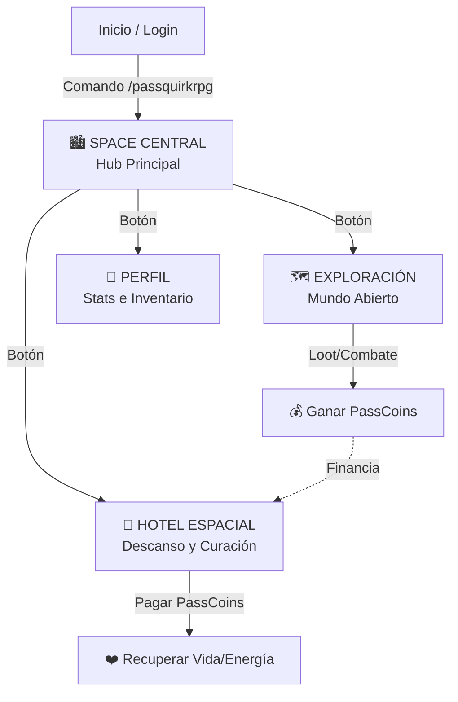
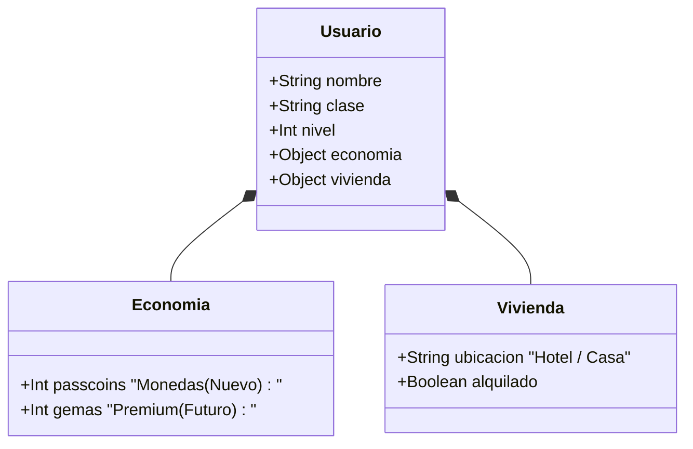

# 🌌 PLAN MAESTRO: Space Central & Economía (PassCoins)

> **Objetivo:** Transformar "Space Central" en el Hub/Casa del jugador, introduciendo la economía (PassCoins) y el sistema de alojamiento (Hotel).

---

## 1. 🗺️ Mapa del Concepto (Visual)



---

## 2. 🪙 La Economía: PassCoins

**¿Qué son?** La moneda oficial del universo PassQuirk.
**Imagen:** `PassCoin.png`

### 🔄 Ciclo de la Economía
1.  **GANAR:** El jugador explora el mundo (`/explorar`).
    *   Encuentra cofres.
    *   Derrota enemigos.
    *   Completa eventos.
2.  **GASTAR:** El jugador usa sus monedas en Space Central.
    *   **Alquiler de Hotel:** Para curarse al 100%.
    *   *(Futuro)* **Tienda:** Comprar pociones o equipo.

---

## 3. 🏨 El Hotel Espacial (Tu "Casa" Temporal)

Hasta que puedas comprar una casa propia, vivirás aquí.

*   **Acceso:** Desde el menú de Space Central.
*   **Coste:** `50 PassCoins` por estancia.
*   **Efecto:** Restaura **100% HP** y **100% Energía**.
*   **Mensaje:** "Has descansado plácidamente en tu cápsula. Te sientes renovado."

---

## 4. 💾 Esquema de Datos (Lo que guardamos)

Necesitamos añadir estos nuevos datos a la ficha de cada jugador:



**Ejemplo en Código (JSON):**
```json
{
  "userId": "123456789",
  "economy": {
    "passcoins": 150
  },
  "housing": {
    "currentLocation": "Hotel Space Central"
  }
}
```

---

## 5. 🛠️ Hoja de Ruta (Paso a Paso)

Aquí tienes el plan de trabajo para implementarlo.

### 🟢 Fase 1: Cimientos (Base de Datos)
- [ ] **Actualizar DB:** Modificar el sistema de guardado para que todos los jugadores tengan `passcoins: 0` al empezar.
- [ ] **Migración:** Asegurar que los jugadores antiguos reciban la actualización sin perder datos.

### 🟡 Fase 2: Ganar Dinero (Exploración)
- [ ] **Modificar `/explorar`:** Añadir probabilidad de encontrar PassCoins.
- [ ] **Loot de Enemigos:** Que los enemigos suelten monedas al morir.
- [ ] **Visuales:** Mostrar el icono de PassCoin en los mensajes de recompensa.

### 🟠 Fase 3: Space Central (Interfaz)
- [ ] **Crear Menú Principal:** Un embed bonito con la imagen de la ciudad.
- [ ] **Botones de Navegación:** Conectar Hotel, Exploración y Perfil.

### 🔴 Fase 4: Gastar Dinero (Hotel)
- [ ] **Lógica de Cobro:** Verificar si tienes suficientes monedas.
- [ ] **Lógica de Curación:** Restaurar vida al pagar.
- [ ] **Mensajes:** Respuestas divertidas del recepcionista del hotel.

---

## 6. 📸 Referencias Visuales
*   **Moneda:** `documentation/.../PassCoin.png`
*   **Ciudad:** *Pendiente de generar/buscar imagen cyberpunk/espacial.*
*   **Hotel:** *Pendiente de generar imagen de recepción futurista.*
